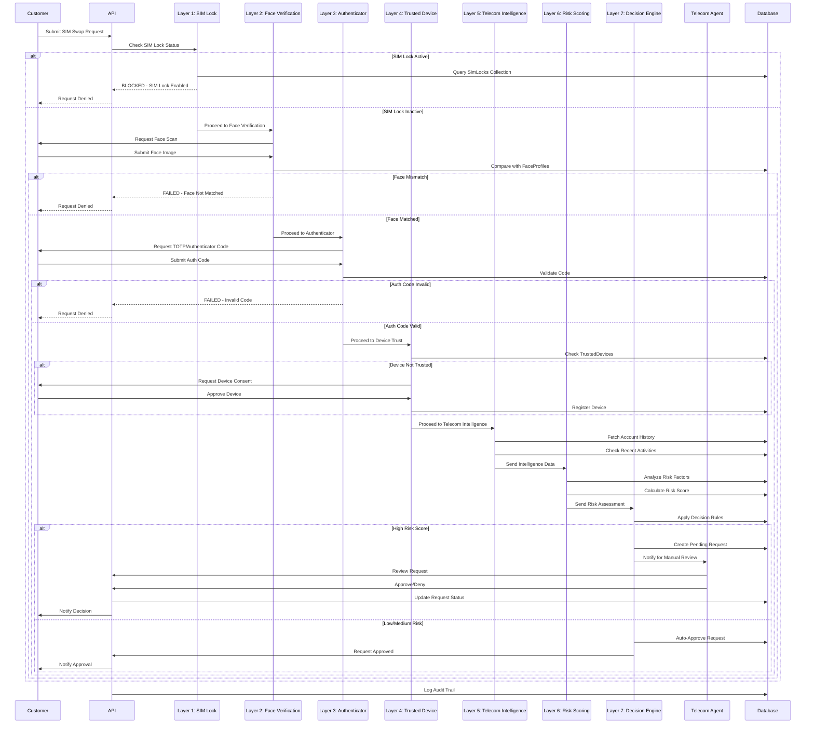

## Design Document: SIMShield 360 Backend Architecture

## Overview

SIMShield 360 is an enterprise-grade telecom security platform that prevents SIM swap, eSIM transfer, and port-out fraud through a sophisticated 7-layer authorization firewall. The backend system implements a multi-tiered security validation workflow that processes SIM swap requests through sequential security layers, each layer adding additional verification and risk assessment before final approval or denial.

The architecture is built on Node.js with Express.js framework, MongoDB Atlas for data persistence, and JWT for stateless authentication. It supports two primary user roles: Customers (end-users who own SIMs) and Telecom Agents (staff who process requests). The system provides real-time risk assessment, comprehensive audit logging, role-based access control, and secure authentication mechanisms to ensure enterprise-level security and compliance.

The backend is designed to be scalable, maintainable, and production-ready with clear separation of concerns through a layered architecture pattern (routes → controllers → services → models). All security-critical operations are logged, all state transitions are tracked, and all authorization decisions are auditable.

## Main System Architecture

```mermaid
graph TB
    subgraph "Client Layer"
        FE[Frontend Application]
    end
    
    subgraph "API Gateway Layer"
        AG[Express API Server]
        MW[Middleware Pipeline]
    end
    
    subgraph "Authentication & Authorization"
        AUTH[JWT Auth Service]
        RBAC[RBAC Service]
    end
    
    subgraph "Business Logic Layer"
        C1[Auth Controller]
        C2[SIM Lock Controller]
        C3[Swap Request Controller]
        C4[Verification Controller]
        C5[Risk Controller]
        C6[Audit Controller]
    end
    
    subgraph "Service Layer"
        S1[User Service]
        S2[SIM Lock Service]
        S3[Swap Workflow Service]
        S4[Face Verification Service]
        S5[Authenticator Service]
        S6[Device Trust Service]
        S7[Telecom Intelligence Service]
        S8[Risk Scoring Engine]
        S9[Decision Engine]
        S10[Notification Service]
        S11[Audit Service]
    end
    
    subgraph "Data Access Layer"
        M1[(Users Collection)]
        M2[(SimLocks Collection)]
        M3[(SimSwapRequests Collection)]
        M4[(TrustedDevices Collection)]
        M5[(FaceProfiles Collection)]
        M6[(VerificationSessions Collection)]
        M7[(RiskLogs Collection)]
        M8[(AuditLogs Collection)]
        M9[(Notifications Collection)]
    end
    
    subgraph "External Services"
        EXT1[Face Recognition API]
        EXT2[Authenticator Validation]
        EXT3[Device Fingerprinting]
        EXT4[Telecom API]
    end

    FE -->|HTTP/HTTPS| AG
    AG --> MW
    MW --> AUTH
    MW --> RBAC
    
    AG --> C1
    AG --> C2
    AG --> C3
    AG --> C4
    AG --> C5
    AG --> C6
    
    C1 --> S1
    C2 --> S2
    C3 --> S3
    C4 --> S4
    C4 --> S5
    C4 --> S6
    C5 --> S7
    C5 --> S8
    C5 --> S9
    C6 --> S11
    
    S1 --> M1
    S2 --> M2
    S3 --> M3
    S4 --> M5
    S5 --> M1
    S6 --> M4
    S7 --> M3
    S8 --> M7
    S9 --> M3
    S10 --> M9
    S11 --> M8
    
    S4 -.->|External Call| EXT1
    S5 -.->|External Call| EXT2
    S6 -.->|External Call| EXT3
    S7 -.->|External Call| EXT4
```



## 7-Layer Security Firewall Workflow



## Architecture Components

### 1. Folder Structure

```typescript
simshield-backend/
├── src/
│   ├── config/
│   │   ├── database.config.ts          // MongoDB connection configuration
│   │   ├── jwt.config.ts               // JWT secret and options
│   │   ├── environment.config.ts       // Environment variables validation
│   │   └── constants.ts                // System-wide constants
│   ├── models/
│   │   ├── User.model.ts               // User schema and model
│   │   ├── SimLock.model.ts            // SIM lock schema
│   │   ├── SimSwapRequest.model.ts     // Swap request schema
│   │   ├── TrustedDevice.model.ts      // Trusted device schema
│   │   ├── FaceProfile.model.ts        // Face verification data
│   │   ├── VerificationSession.model.ts // Verification session tracking
│   │   ├── RiskLog.model.ts            // Risk assessment logs
│   │   ├── AuditLog.model.ts           // Audit trail logs
│   │   └── Notification.model.ts       // Notification schema
│   ├── routes/
│   │   ├── index.ts                    // Route aggregator
│   │   ├── auth.routes.ts              // Authentication endpoints
│   │   ├── simlock.routes.ts           // SIM lock management
│   │   ├── swap.routes.ts              // Swap request endpoints
│   │   ├── verification.routes.ts      // Verification layer endpoints
│   │   ├── risk.routes.ts              // Risk assessment endpoints
│   │   ├── audit.routes.ts             // Audit log endpoints
│   │   ├── device.routes.ts            // Device management endpoints
│   │   └── notification.routes.ts      // Notification endpoints
│   ├── controllers/
│   │   ├── auth.controller.ts          // Authentication logic
│   │   ├── simlock.controller.ts       // SIM lock operations
│   │   ├── swap.controller.ts          // Swap request handling
│   │   ├── verification.controller.ts  // Multi-layer verification
│   │   ├── risk.controller.ts          // Risk assessment operations
│   │   ├── audit.controller.ts         // Audit log retrieval
│   │   ├── device.controller.ts        // Device management
│   │   └── notification.controller.ts  // Notification handling
│   ├── services/
│   │   ├── auth/
│   │   │   ├── jwt.service.ts          // JWT token operations
│   │   │   ├── password.service.ts     // Password hashing/validation
│   │   │   └── session.service.ts      // Session management
│   │   ├── user/
│   │   │   └── user.service.ts         // User CRUD operations
│   │   ├── simlock/
│   │   │   └── simlock.service.ts      // SIM lock operations
│   │   ├── swap/
│   │   │   ├── swap.service.ts         // Swap request lifecycle
│   │   │   └── workflow.service.ts     // Workflow orchestration
│   │   ├── verification/
│   │   │   ├── face.service.ts         // Face verification (Layer 2)
│   │   │   ├── authenticator.service.ts // TOTP validation (Layer 3)
│   │   │   └── device.service.ts       // Device trust (Layer 4)
│   │   ├── intelligence/
│   │   │   └── telecom.service.ts      // Telecom data (Layer 5)
│   │   ├── risk/
│   │   │   ├── scoring.service.ts      // Risk scoring (Layer 6)
│   │   │   └── decision.service.ts     // Decision engine (Layer 7)
│   │   ├── audit/
│   │   │   └── audit.service.ts        // Audit logging
│   │   └── notification/
│   │       └── notification.service.ts // Notification dispatch
│   ├── middleware/
│   │   ├── auth.middleware.ts          // JWT validation
│   │   ├── rbac.middleware.ts          // Role-based access control
│   │   ├── validation.middleware.ts    // Request validation
│   │   ├── error.middleware.ts         // Error handling
│   │   ├── rateLimit.middleware.ts     // Rate limiting
│   │   ├── logging.middleware.ts       // Request logging
│   │   └── cors.middleware.ts          // CORS configuration
│   ├── validators/
│   │   ├── auth.validator.ts           // Auth request schemas
│   │   ├── simlock.validator.ts        // SIM lock schemas
│   │   ├── swap.validator.ts           // Swap request schemas
│   │   └── common.validator.ts         // Shared validation rules
│   ├── types/
│   │   ├── express.d.ts                // Express type extensions
│   │   ├── user.types.ts               // User-related types
│   │   ├── swap.types.ts               // Swap-related types
│   │   ├── risk.types.ts               // Risk assessment types
│   │   └── common.types.ts             // Shared types
│   ├── utils/
│   │   ├── crypto.util.ts              // Encryption utilities
│   │   ├── date.util.ts                // Date manipulation
│   │   ├── response.util.ts            // Standardized responses
│   │   └── logger.util.ts              // Winston logger setup
│   ├── app.ts                          // Express app configuration
│   └── server.ts                       // Server entry point
├── tests/
│   ├── unit/                           // Unit tests
│   ├── integration/                    // Integration tests
│   └── e2e/                            // End-to-end tests
├── .env.example                        // Environment template
├── .gitignore
├── package.json
├── tsconfig.json
└── README.md
```

### 2. Core Data Models

```typescript
// User Model
interface IUser {
  _id: ObjectId;
  email: string;
  passwordHash: string;
  role: 'customer' | 'agent';
  profile: {
    firstName: string;
    lastName: string;
    phone: string;
  };
  simCard?: {
    iccid: string;
    msisdn: string;
    carrier: string;
  };
  authenticator?: {
    secret: string;
    isEnabled: boolean;
    backupCodes: string[];
  };
  isActive: boolean;
  isVerified: boolean;
  createdAt: Date;
  updatedAt: Date;
}

// SIM Lock Model
interface ISimLock {
  _id: ObjectId;
  userId: ObjectId;
  iccid: string;
  isLocked: boolean;
  lockType: 'user_initiated' | 'system_initiated';
  lockReason?: string;
  lockedAt?: Date;
  unlockedAt?: Date;
  createdAt: Date;
  updatedAt: Date;
}

// SIM Swap Request Model
interface ISimSwapRequest {
  _id: ObjectId;
  requestId: string;
  userId: ObjectId;
  requestType: 'sim_swap' | 'esim_transfer' | 'port_out';
  status: 'pending' | 'layer1_blocked' | 'layer2_pending' | 'layer2_failed' | 
          'layer3_pending' | 'layer3_failed' | 'layer4_pending' | 'layer4_failed' |
          'layer5_processing' | 'layer6_processing' | 'layer7_pending_manual' |
          'approved' | 'denied' | 'expired' | 'cancelled';
  currentLayer: 1 | 2 | 3 | 4 | 5 | 6 | 7;
  layerResults: {
    layer1?: { passed: boolean; timestamp: Date; reason?: string; };
    layer2?: { passed: boolean; timestamp: Date; faceMatchScore?: number; };
    layer3?: { passed: boolean; timestamp: Date; };
    layer4?: { passed: boolean; timestamp: Date; deviceId?: string; };
    layer5?: { passed: boolean; timestamp: Date; intelligenceData?: any; };
    layer6?: { passed: boolean; timestamp: Date; riskScore?: number; };
    layer7?: { passed: boolean; timestamp: Date; decision: string; reviewedBy?: ObjectId; };
  };
  riskScore?: number;
  riskLevel?: 'low' | 'medium' | 'high' | 'critical';
  deviceFingerprint?: string;
  ipAddress?: string;
  location?: { latitude: number; longitude: number; country: string; };
  agentReview?: {
    reviewedBy: ObjectId;
    reviewedAt: Date;
    decision: 'approved' | 'denied';
    comments?: string;
  };
  expiresAt: Date;
  createdAt: Date;
  updatedAt: Date;
}

// Trusted Device Model
interface ITrustedDevice {
  _id: ObjectId;
  userId: ObjectId;
  deviceFingerprint: string;
  deviceName: string;
  deviceType: 'mobile' | 'tablet' | 'desktop';
  browser?: string;
  os?: string;
  isTrusted: boolean;
  lastUsedAt: Date;
  trustGrantedAt: Date;
  createdAt: Date;
  updatedAt: Date;
}

// Face Profile Model
interface IFaceProfile {
  _id: ObjectId;
  userId: ObjectId;
  faceEncodingData: string; // Encrypted face encoding vector
  capturedAt: Date;
  isActive: boolean;
  verificationCount: number;
  lastVerifiedAt?: Date;
  createdAt: Date;
  updatedAt: Date;
}

// Verification Session Model
interface IVerificationSession {
  _id: ObjectId;
  requestId: string;
  userId: ObjectId;
  sessionType: 'face' | 'authenticator' | 'device_consent';
  status: 'pending' | 'verified' | 'failed' | 'expired';
  attempts: number;
  maxAttempts: number;
  verificationData?: any;
  expiresAt: Date;
  completedAt?: Date;
  createdAt: Date;
  updatedAt: Date;
}

// Risk Log Model
interface IRiskLog {
  _id: ObjectId;
  requestId: string;
  userId: ObjectId;
  riskFactors: {
    deviceTrust: number;
    locationAnomaly: number;
    timeAnomaly: number;
    behaviorScore: number;
    accountAge: number;
    previousSwaps: number;
    telecomIntelligence: number;
  };
  aggregatedScore: number;
  riskLevel: 'low' | 'medium' | 'high' | 'critical';
  recommendations: string[];
  calculatedAt: Date;
  createdAt: Date;
}

// Audit Log Model
interface IAuditLog {
  _id: ObjectId;
  userId?: ObjectId;
  agentId?: ObjectId;
  action: string;
  resource: string;
  resourceId?: string;
  method: 'GET' | 'POST' | 'PUT' | 'PATCH' | 'DELETE';
  ipAddress: string;
  userAgent?: string;
  requestBody?: any;
  responseStatus?: number;
  changes?: { before?: any; after?: any; };
  timestamp: Date;
}

// Notification Model
interface INotification {
  _id: ObjectId;
  userId: ObjectId;
  type: 'swap_request_created' | 'swap_approved' | 'swap_denied' | 
        'sim_locked' | 'sim_unlocked' | 'suspicious_activity' | 
        'device_trusted' | 'verification_required';
  priority: 'low' | 'medium' | 'high' | 'urgent';
  title: string;
  message: string;
  metadata?: any;
  isRead: boolean;
  readAt?: Date;
  createdAt: Date;
}
```

### 3. API Route Architecture

```typescript
// Auth Routes
POST   /api/v1/auth/register              // Register new user
POST   /api/v1/auth/login                 // Login user
POST   /api/v1/auth/logout                // Logout user
POST   /api/v1/auth/refresh-token         // Refresh JWT token
POST   /api/v1/auth/forgot-password       // Request password reset
POST   /api/v1/auth/reset-password        // Reset password
GET    /api/v1/auth/me                    // Get current user profile
PUT    /api/v1/auth/profile               // Update user profile
POST   /api/v1/auth/setup-authenticator   // Setup TOTP authenticator
POST   /api/v1/auth/verify-authenticator  // Verify authenticator setup
POST   /api/v1/auth/disable-authenticator // Disable authenticator

// SIM Lock Routes (Customer & Agent)
GET    /api/v1/simlocks                   // Get user's SIM locks
GET    /api/v1/simlocks/:id               // Get specific SIM lock
POST   /api/v1/simlocks                   // Create SIM lock
PUT    /api/v1/simlocks/:id/lock          // Enable SIM lock
PUT    /api/v1/simlocks/:id/unlock        // Disable SIM lock
DELETE /api/v1/simlocks/:id               // Remove SIM lock
GET    /api/v1/simlocks/:id/history       // Get lock/unlock history

// SIM Swap Request Routes
POST   /api/v1/swap-requests               // Create new swap request
GET    /api/v1/swap-requests               // List user's requests (Customer)
GET    /api/v1/swap-requests/pending       // List pending requests (Agent)
GET    /api/v1/swap-requests/:id           // Get request details
PUT    /api/v1/swap-requests/:id/cancel    // Cancel request (Customer)
POST   /api/v1/swap-requests/:id/approve   // Approve request (Agent)
POST   /api/v1/swap-requests/:id/deny      // Deny request (Agent)

// Verification Layer Routes
POST   /api/v1/verification/face           // Submit face verification
POST   /api/v1/verification/authenticator  // Submit authenticator code
POST   /api/v1/verification/device-consent // Grant device consent
GET    /api/v1/verification/sessions/:id   // Get verification session status

// Device Management Routes
GET    /api/v1/devices                     // Get trusted devices
POST   /api/v1/devices/register            // Register new device
DELETE /api/v1/devices/:id                 // Remove trusted device
PUT    /api/v1/devices/:id/trust           // Mark device as trusted

// Risk Assessment Routes (Agent)
GET    /api/v1/risk/requests/:id           // Get risk assessment
GET    /api/v1/risk/logs                   // List risk logs
GET    /api/v1/risk/analytics               // Get risk analytics
GET    /api/v1/risk/factors/:requestId     // Get detailed risk factors

// Audit Log Routes (Agent)
GET    /api/v1/audit/logs                  // List audit logs
GET    /api/v1/audit/logs/:id              // Get specific audit log
GET    /api/v1/audit/users/:userId         // Get user activity logs
GET    /api/v1/audit/export                // Export audit logs

// Notification Routes
GET    /api/v1/notifications               // Get user notifications
PUT    /api/v1/notifications/:id/read      // Mark notification as read
PUT    /api/v1/notifications/read-all      // Mark all as read
DELETE /api/v1/notifications/:id           // Delete notification
```

### 4. Controller Architecture

```typescript
// Swap Request Controller (swap.controller.ts)
class SwapController {
  async createSwapRequest(req: AuthRequest, res: Response): Promise<void>
  async listSwapRequests(req: AuthRequest, res: Response): Promise<void>
  async getSwapRequest(req: AuthRequest, res: Response): Promise<void>
  async cancelSwapRequest(req: AuthRequest, res: Response): Promise<void>
  async approveSwapRequest(req: AuthRequest, res: Response): Promise<void>
  async denySwapRequest(req: AuthRequest, res: Response): Promise<void>
  async listPendingRequests(req: AuthRequest, res: Response): Promise<void>
}

// Verification Controller (verification.controller.ts)
class VerificationController {
  async submitFaceVerification(req: AuthRequest, res: Response): Promise<void>
  async submitAuthenticatorCode(req: AuthRequest, res: Response): Promise<void>
  async grantDeviceConsent(req: AuthRequest, res: Response): Promise<void>
  async getVerificationSession(req: AuthRequest, res: Response): Promise<void>
}

// Risk Controller (risk.controller.ts)
class RiskController {
  async getRiskAssessment(req: AuthRequest, res: Response): Promise<void>
  async listRiskLogs(req: AuthRequest, res: Response): Promise<void>
  async getRiskAnalytics(req: AuthRequest, res: Response): Promise<void>
  async getDetailedRiskFactors(req: AuthRequest, res: Response): Promise<void>
}
```

### 5. Service Architecture

```typescript
// Swap Workflow Service (swap/workflow.service.ts)
class WorkflowService {
  async initiateSwapRequest(userId: string, requestData: any): Promise<ISimSwapRequest>
  async processLayer1_SimLock(requestId: string): Promise<LayerResult>
  async processLayer2_FaceVerification(requestId: string, faceData: any): Promise<LayerResult>
  async processLayer3_Authenticator(requestId: string, code: string): Promise<LayerResult>
  async processLayer4_DeviceTrust(requestId: string, deviceData: any): Promise<LayerResult>
  async processLayer5_TelecomIntelligence(requestId: string): Promise<LayerResult>
  async processLayer6_RiskScoring(requestId: string): Promise<LayerResult>
  async processLayer7_DecisionEngine(requestId: string): Promise<LayerResult>
  async transitionToNextLayer(requestId: string): Promise<void>
  async updateRequestStatus(requestId: string, status: string): Promise<void>
}

// Risk Scoring Service (risk/scoring.service.ts)
class RiskScoringService {
  async calculateRiskScore(requestId: string): Promise<RiskAssessment>
  async evaluateDeviceTrust(deviceId: string, userId: string): Promise<number>
  async evaluateLocationAnomaly(location: Location, userId: string): Promise<number>
  async evaluateTimeAnomaly(timestamp: Date, userId: string): Promise<number>
  async evaluateBehaviorScore(userId: string): Promise<number>
  async evaluateAccountAge(userId: string): Promise<number>
  async evaluatePreviousSwaps(userId: string): Promise<number>
  async aggregateRiskFactors(factors: RiskFactors): Promise<number>
  async determineRiskLevel(score: number): 'low' | 'medium' | 'high' | 'critical'
}

// Decision Engine Service (risk/decision.service.ts)
class DecisionEngineService {
  async makeDecision(requestId: string, riskScore: number): Promise<Decision>
  async applyDecisionRules(riskScore: number, request: ISimSwapRequest): Promise<string>
  async routeToManualReview(requestId: string): Promise<void>
  async autoApproveRequest(requestId: string): Promise<void>
  async autoDenyRequest(requestId: string, reason: string): Promise<void>
}

// Face Verification Service (verification/face.service.ts)
class FaceVerificationService {
  async verifyFace(userId: string, faceImage: Buffer): Promise<VerificationResult>
  async registerFaceProfile(userId: string, faceImage: Buffer): Promise<IFaceProfile>
  async compareFaces(capturedEncoding: number[], storedEncoding: number[]): Promise<number>
  async encryptFaceData(encoding: number[]): Promise<string>
  async decryptFaceData(encrypted: string): Promise<number[]>
}

// Authenticator Service (verification/authenticator.service.ts)
class AuthenticatorService {
  async generateSecret(userId: string): Promise<{ secret: string; qrCode: string }>
  async verifyTOTP(userId: string, token: string): Promise<boolean>
  async enableAuthenticator(userId: string, secret: string, token: string): Promise<void>
  async disableAuthenticator(userId: string): Promise<void>
  async generateBackupCodes(userId: string): Promise<string[]>
}

// Device Trust Service (verification/device.service.ts)
class DeviceTrustService {
  async checkDeviceTrust(deviceFingerprint: string, userId: string): Promise<boolean>
  async registerDevice(userId: string, deviceData: DeviceData): Promise<ITrustedDevice>
  async trustDevice(userId: string, deviceId: string): Promise<void>
  async removeDevice(userId: string, deviceId: string): Promise<void>
  async generateDeviceFingerprint(req: Request): Promise<string>
}
```

### 6. Middleware Architecture

```typescript
// Authentication Middleware (auth.middleware.ts)
export const authenticate = async (req: AuthRequest, res: Response, next: NextFunction): Promise<void>
// Validates JWT token, attaches user to request, handles token expiration

// RBAC Middleware (rbac.middleware.ts)
export const authorize = (...roles: UserRole[]) => 
  async (req: AuthRequest, res: Response, next: NextFunction): Promise<void>
// Checks if authenticated user has required role(s)

// Validation Middleware (validation.middleware.ts)
export const validate = (schema: ValidationSchema) => 
  async (req: Request, res: Response, next: NextFunction): Promise<void>
// Validates request body/params/query against Zod/Joi schema

// Rate Limiting Middleware (rateLimit.middleware.ts)
export const rateLimiter = (options: RateLimitOptions) => 
  async (req: Request, res: Response, next: NextFunction): Promise<void>
// Prevents abuse by limiting requests per IP/user

// Error Handling Middleware (error.middleware.ts)
export const errorHandler = (err: Error, req: Request, res: Response, next: NextFunction): void
// Centralized error handling, logging, and response formatting

// Logging Middleware (logging.middleware.ts)
export const requestLogger = async (req: Request, res: Response, next: NextFunction): Promise<void>
// Logs all incoming requests with timestamp, method, path, IP

// Audit Middleware (audit.middleware.ts)
export const auditLog = async (req: AuthRequest, res: Response, next: NextFunction): Promise<void>
// Creates audit trail for sensitive operations
```

### 7. Security Architecture

```typescript
// JWT Configuration (config/jwt.config.ts)
export const jwtConfig = {
  accessTokenSecret: process.env.JWT_ACCESS_SECRET,
  refreshTokenSecret: process.env.JWT_REFRESH_SECRET,
  accessTokenExpiry: '15m',
  refreshTokenExpiry: '7d',
  algorithm: 'HS256' as const
};

// Password Hashing (services/auth/password.service.ts)
class PasswordService {
  async hashPassword(password: string): Promise<string>
  // Uses bcrypt with salt rounds: 12
  
  async verifyPassword(password: string, hash: string): Promise<boolean>
  // Constant-time comparison to prevent timing attacks
  
  async generateSecureToken(length: number): Promise<string>
  // Cryptographically secure random token generation
}

// Encryption Utilities (utils/crypto.util.ts)
export class CryptoUtil {
  static encrypt(data: string, key: string): string
  // AES-256-GCM encryption for sensitive data
  
  static decrypt(encrypted: string, key: string): string
  // AES-256-GCM decryption
  
  static hash(data: string): string
  // SHA-256 hashing for non-password data
  
  static generateKeyPair(): { publicKey: string; privateKey: string }
  // RSA key pair generation for advanced features
}

// RBAC Configuration
export enum UserRole {
  CUSTOMER = 'customer',
  AGENT = 'agent',
  ADMIN = 'admin'
}

export const permissions = {
  customer: [
    'read:own_profile',
    'update:own_profile',
    'create:swap_request',
    'read:own_swap_requests',
    'cancel:own_swap_request',
    'create:simlock',
    'update:own_simlock',
    'read:own_devices',
    'create:device',
    'delete:own_device'
  ],
  agent: [
    'read:all_swap_requests',
    'approve:swap_request',
    'deny:swap_request',
    'read:risk_assessments',
    'read:audit_logs',
    'read:risk_analytics'
  ],
  admin: [
    '*' // All permissions
  ]
};
```

### 8. Database Schema Relationships

```typescript
// MongoDB Collections and Relationships

/**
 * Users Collection
 * - Primary collection for user accounts
 * - Referenced by: SimLocks, SimSwapRequests, TrustedDevices, FaceProfiles, etc.
 */

/**
 * SimLocks Collection
 * - References: Users (userId)
 * - Relationship: One-to-One with User (one lock per SIM)
 */

/**
 * SimSwapRequests Collection
 * - References: Users (userId), Users (agentReview.reviewedBy)
 * - Relationship: Many-to-One with User (user can have multiple requests)
 * - Indexes: requestId (unique), userId, status, currentLayer, createdAt
 */

/**
 * TrustedDevices Collection
 * - References: Users (userId)
 * - Relationship: Many-to-One with User (user can have multiple devices)
 * - Indexes: userId, deviceFingerprint (unique per user)
 */

/**
 * FaceProfiles Collection
 * - References: Users (userId)
 * - Relationship: One-to-One with User (one active profile per user)
 * - Indexes: userId (unique), isActive
 */

/**
 * VerificationSessions Collection
 * - References: Users (userId), SimSwapRequests (requestId)
 * - Relationship: Many-to-One with SimSwapRequest
 * - Indexes: requestId, userId, status, expiresAt
 * - TTL Index: expiresAt (auto-delete expired sessions)
 */

/**
 * RiskLogs Collection
 * - References: Users (userId), SimSwapRequests (requestId)
 * - Relationship: One-to-One with SimSwapRequest
 * - Indexes: requestId (unique), userId, riskLevel, calculatedAt
 */

/**
 * AuditLogs Collection
 * - References: Users (userId), Users (agentId)
 * - Relationship: Many-to-One with User
 * - Indexes: userId, agentId, action, resource, timestamp
 * - Compound Index: userId + timestamp (for efficient user activity queries)
 */

/**
 * Notifications Collection
 * - References: Users (userId)
 * - Relationship: Many-to-One with User
 * - Indexes: userId, type, isRead, priority, createdAt
 * - Compound Index: userId + isRead + createdAt
 */
```

## Algorithmic Pseudocode

### Main Swap Request Workflow Algorithm

```typescript
/**
 * ALGORITHM: Process SIM Swap Request Through 7-Layer Firewall
 * INPUT: userId, requestData (requestType, deviceFingerprint, ipAddress, location)
 * OUTPUT: SwapRequest with final status (approved/denied/pending_manual)
 */

async function processSwapRequest(userId: string, requestData: RequestData): Promise<SwapRequestResult> {
  // Preconditions
  ASSERT userId is valid ObjectId
  ASSERT user exists in database
  ASSERT requestData contains required fields
  
  // Step 1: Initialize swap request
  const request = await createSwapRequest({
    userId,
    requestType: requestData.type,
    status: 'pending',
    currentLayer: 1,
    deviceFingerprint: requestData.deviceFingerprint,
    ipAddress: requestData.ipAddress,
    location: requestData.location,
    expiresAt: Date.now() + 24 * 60 * 60 * 1000 // 24 hours
  });
  
  await auditLog.create({
    userId,
    action: 'create_swap_request',
    resource: 'swap_request',
    resourceId: request.requestId
  });
  
  // Step 2: Layer 1 - SIM Lock Firewall
  const layer1Result = await checkSimLock(userId);
  
  IF layer1Result.isLocked THEN
    await updateRequest(request._id, {
      status: 'layer1_blocked',
      'layerResults.layer1': {
        passed: false,
        timestamp: Date.now(),
        reason: 'SIM lock is enabled'
      }
    });
    await sendNotification(userId, 'swap_denied', 'SIM lock prevented swap');
    RETURN { status: 'denied', reason: 'SIM lock active' };
  END IF
  
  await updateRequest(request._id, {
    currentLayer: 2,
    'layerResults.layer1': { passed: true, timestamp: Date.now() }
  });
  
  // Step 3: Layer 2 - Face Verification (Async - wait for user)
  await createVerificationSession({
    requestId: request.requestId,
    userId,
    sessionType: 'face',
    status: 'pending',
    maxAttempts: 3,
    expiresAt: Date.now() + 10 * 60 * 1000 // 10 minutes
  });
  
  await updateRequest(request._id, { status: 'layer2_pending' });
  await sendNotification(userId, 'verification_required', 'Face verification needed');
  
  // Wait for face verification (handled by separate endpoint)
  // POST /api/v1/verification/face will process Layer 2
  
  RETURN { status: 'pending', currentLayer: 2, requestId: request.requestId };
}

/**
 * ALGORITHM: Process Face Verification (Layer 2)
 * INPUT: requestId, faceImageBuffer
 * OUTPUT: VerificationResult with next steps
 */

async function processFaceVerification(requestId: string, faceImage: Buffer): Promise<VerificationResult> {
  // Preconditions
  ASSERT requestId is valid
  ASSERT request exists and status is 'layer2_pending'
  ASSERT faceImage is valid image buffer
  
  const request = await getSwapRequest(requestId);
  const session = await getVerificationSession(requestId, 'face');
  
  // Check session expiry
  IF session.expiresAt < Date.now() THEN
    await updateRequest(request._id, { status: 'expired' });
    RETURN { success: false, reason: 'Verification session expired' };
  END IF
  
  // Check max attempts
  IF session.attempts >= session.maxAttempts THEN
    await updateRequest(request._id, { status: 'layer2_failed' });
    RETURN { success: false, reason: 'Max attempts exceeded' };
  END IF
  
  // Increment attempt counter
  await updateVerificationSession(session._id, { attempts: session.attempts + 1 });
  
  // Perform face verification
  const faceProfile = await getFaceProfile(request.userId);
  const capturedEncoding = await extractFaceEncoding(faceImage);
  const storedEncoding = await decryptFaceData(faceProfile.faceEncodingData);
  const matchScore = await compareFaces(capturedEncoding, storedEncoding);
  
  const FACE_MATCH_THRESHOLD = 0.85; // 85% similarity required
  
  IF matchScore < FACE_MATCH_THRESHOLD THEN
    await updateRequest(request._id, {
      'layerResults.layer2': {
        passed: false,
        timestamp: Date.now(),
        faceMatchScore: matchScore
      }
    });
    
    IF session.attempts + 1 >= session.maxAttempts THEN
      await updateRequest(request._id, { status: 'layer2_failed' });
      await sendNotification(request.userId, 'swap_denied', 'Face verification failed');
      RETURN { success: false, reason: 'Face verification failed - max attempts reached' };
    END IF
    
    RETURN { success: false, reason: 'Face does not match', attemptsRemaining: session.maxAttempts - session.attempts - 1 };
  END IF
  
  // Face verified successfully
  await updateRequest(request._id, {
    currentLayer: 3,
    status: 'layer3_pending',
    'layerResults.layer2': {
      passed: true,
      timestamp: Date.now(),
      faceMatchScore: matchScore
    }
  });
  
  await updateVerificationSession(session._id, { status: 'verified', completedAt: Date.now() });
  
  // Create next verification session for authenticator
  await createVerificationSession({
    requestId: request.requestId,
    userId: request.userId,
    sessionType: 'authenticator',
    status: 'pending',
    maxAttempts: 3,
    expiresAt: Date.now() + 5 * 60 * 1000 // 5 minutes
  });
  
  await sendNotification(request.userId, 'verification_required', 'Authenticator code needed');
  
  RETURN { success: true, nextLayer: 3, message: 'Face verified - proceed to authenticator' };
}

/**
 * ALGORITHM: Process Authenticator Verification (Layer 3)
 * INPUT: requestId, totpCode
 * OUTPUT: VerificationResult with next steps
 */

async function processAuthenticatorVerification(requestId: string, totpCode: string): Promise<VerificationResult> {
  // Preconditions
  ASSERT requestId is valid
  ASSERT request status is 'layer3_pending'
  ASSERT totpCode is 6-digit string
  
  const request = await getSwapRequest(requestId);
  const session = await getVerificationSession(requestId, 'authenticator');
  const user = await getUser(request.userId);
  
  // Check if authenticator is enabled
  IF NOT user.authenticator?.isEnabled THEN
    // Skip this layer if authenticator not set up
    await updateRequest(request._id, {
      currentLayer: 4,
      status: 'layer4_pending',
      'layerResults.layer3': {
        passed: true,
        timestamp: Date.now()
      }
    });
    RETURN { success: true, nextLayer: 4, skipped: true };
  END IF
  
  // Check session expiry
  IF session.expiresAt < Date.now() THEN
    await updateRequest(request._id, { status: 'expired' });
    RETURN { success: false, reason: 'Verification session expired' };
  END IF
  
  // Check max attempts
  IF session.attempts >= session.maxAttempts THEN
    await updateRequest(request._id, { status: 'layer3_failed' });
    RETURN { success: false, reason: 'Max attempts exceeded' };
  END IF
  
  await updateVerificationSession(session._id, { attempts: session.attempts + 1 });
  
  // Verify TOTP code
  const isValid = await verifyTOTP(user.authenticator.secret, totpCode);
  
  IF NOT isValid THEN
    IF session.attempts + 1 >= session.maxAttempts THEN
      await updateRequest(request._id, { status: 'layer3_failed' });
      await sendNotification(request.userId, 'swap_denied', 'Authenticator verification failed');
      RETURN { success: false, reason: 'Invalid code - max attempts reached' };
    END IF
    
    RETURN { success: false, reason: 'Invalid authenticator code', attemptsRemaining: session.maxAttempts - session.attempts - 1 };
  END IF
  
  // Authenticator verified successfully
  await updateRequest(request._id, {
    currentLayer: 4,
    status: 'layer4_pending',
    'layerResults.layer3': {
      passed: true,
      timestamp: Date.now()
    }
  });
  
  await updateVerificationSession(session._id, { status: 'verified', completedAt: Date.now() });
  
  // Proceed to Layer 4 - Device Trust (automatic check)
  RETURN await processDeviceTrust(requestId);
}

/**
 * ALGORITHM: Process Device Trust Verification (Layer 4)
 * INPUT: requestId
 * OUTPUT: VerificationResult with next steps
 */

async function processDeviceTrust(requestId: string): Promise<VerificationResult> {
  // Preconditions
  ASSERT requestId is valid
  ASSERT request status is 'layer4_pending'
  
  const request = await getSwapRequest(requestId);
  const deviceFingerprint = request.deviceFingerprint;
  
  // Check if device is already trusted
  const trustedDevice = await findTrustedDevice(request.userId, deviceFingerprint);
  
  IF trustedDevice AND trustedDevice.isTrusted THEN
    // Device is trusted, proceed to next layer
    await updateRequest(request._id, {
      currentLayer: 5,
      status: 'layer5_processing',
      'layerResults.layer4': {
        passed: true,
        timestamp: Date.now(),
        deviceId: trustedDevice._id
      }
    });
    
    // Proceed to Layers 5, 6, 7 (automatic)
    RETURN await processTelecomIntelligence(requestId);
  ELSE
    // Device not trusted - require consent
    await createVerificationSession({
      requestId: request.requestId,
      userId: request.userId,
      sessionType: 'device_consent',
      status: 'pending',
      maxAttempts: 1,
      expiresAt: Date.now() + 15 * 60 * 1000 // 15 minutes
    });
    
    await sendNotification(request.userId, 'verification_required', 'Device consent required');
    
    RETURN { success: true, requiresConsent: true, message: 'New device detected - consent required' };
  END IF
}

/**
 * ALGORITHM: Process Telecom Intelligence (Layer 5)
 * INPUT: requestId
 * OUTPUT: IntelligenceResult
 */

async function processTelecomIntelligence(requestId: string): Promise<IntelligenceResult> {
  // Preconditions
  ASSERT requestId is valid
  ASSERT request status is 'layer5_processing'
  
  const request = await getSwapRequest(requestId);
  const user = await getUser(request.userId);
  
  // Gather telecom intelligence data
  const intelligenceData = {
    accountAge: await calculateAccountAge(user.createdAt),
    previousSwaps: await countPreviousSwaps(request.userId, 90), // Last 90 days
    recentActivity: await getRecentActivity(request.userId, 30), // Last 30 days
    carrierHistory: await getCarrierHistory(user.simCard?.msisdn),
    suspiciousPatterns: await detectSuspiciousPatterns(request.userId)
  };
  
  await updateRequest(request._id, {
    currentLayer: 6,
    status: 'layer6_processing',
    'layerResults.layer5': {
      passed: true,
      timestamp: Date.now(),
      intelligenceData
    }
  });
  
  // Proceed to Layer 6 - Risk Scoring
  RETURN await processRiskScoring(requestId, intelligenceData);
}

/**
 * ALGORITHM: Process Risk Scoring (Layer 6)
 * INPUT: requestId, intelligenceData
 * OUTPUT: RiskAssessment
 */

async function processRiskScoring(requestId: string, intelligenceData: any): Promise<RiskAssessment> {
  // Preconditions
  ASSERT requestId is valid
  ASSERT request status is 'layer6_processing'
  
  const request = await getSwapRequest(requestId);
  const user = await getUser(request.userId);
  
  // Calculate individual risk factors (0-100 scale)
  const riskFactors = {
    deviceTrust: await evaluateDeviceTrust(request.deviceFingerprint, request.userId),
    locationAnomaly: await evaluateLocationAnomaly(request.location, request.userId),
    timeAnomaly: await evaluateTimeAnomaly(request.createdAt, request.userId),
    behaviorScore: await evaluateBehaviorScore(request.userId),
    accountAge: await evaluateAccountAge(intelligenceData.accountAge),
    previousSwaps: await evaluatePreviousSwaps(intelligenceData.previousSwaps),
    telecomIntelligence: await evaluateTelecomIntelligence(intelligenceData)
  };
  
  // Weighted aggregation
  const weights = {
    deviceTrust: 0.15,
    locationAnomaly: 0.15,
    timeAnomaly: 0.10,
    behaviorScore: 0.20,
    accountAge: 0.10,
    previousSwaps: 0.15,
    telecomIntelligence: 0.15
  };
  
  let aggregatedScore = 0;
  FOR EACH factor IN riskFactors DO
    aggregatedScore += riskFactors[factor] * weights[factor];
  END FOR
  
  // Determine risk level
  let riskLevel: RiskLevel;
  IF aggregatedScore >= 80 THEN
    riskLevel = 'critical';
  ELSE IF aggregatedScore >= 60 THEN
    riskLevel = 'high';
  ELSE IF aggregatedScore >= 40 THEN
    riskLevel = 'medium';
  ELSE
    riskLevel = 'low';
  END IF
  
  // Store risk assessment
  await createRiskLog({
    requestId: request.requestId,
    userId: request.userId,
    riskFactors,
    aggregatedScore,
    riskLevel,
    recommendations: generateRecommendations(riskFactors, riskLevel),
    calculatedAt: Date.now()
  });
  
  await updateRequest(request._id, {
    currentLayer: 7,
    status: 'layer7_pending_manual',
    riskScore: aggregatedScore,
    riskLevel,
    'layerResults.layer6': {
      passed: true,
      timestamp: Date.now(),
      riskScore: aggregatedScore
    }
  });
  
  // Proceed to Layer 7 - Decision Engine
  RETURN await processDecisionEngine(requestId, aggregatedScore, riskLevel);
}

/**
 * ALGORITHM: Process Decision Engine (Layer 7)
 * INPUT: requestId, riskScore, riskLevel
 * OUTPUT: FinalDecision
 */

async function processDecisionEngine(requestId: string, riskScore: number, riskLevel: RiskLevel): Promise<FinalDecision> {
  // Preconditions
  ASSERT requestId is valid
  ASSERT riskScore is between 0 and 100
  ASSERT riskLevel is valid enum value
  
  const request = await getSwapRequest(requestId);
  
  // Decision rules
  const AUTO_APPROVE_THRESHOLD = 30;  // Score < 30 = auto-approve
  const AUTO_DENY_THRESHOLD = 90;     // Score >= 90 = auto-deny
  
  IF riskScore >= AUTO_DENY_THRESHOLD THEN
    // Auto-deny due to critical risk
    await updateRequest(request._id, {
      status: 'denied',
      'layerResults.layer7': {
        passed: false,
        timestamp: Date.now(),
        decision: 'auto_denied',
        reason: 'Critical risk level detected'
      }
    });
    
    await sendNotification(request.userId, 'swap_denied', 'Request denied due to high risk');
    await auditLog.create({
      userId: request.userId,
      action: 'auto_deny_swap_request',
      resource: 'swap_request',
      resourceId: request.requestId
    });
    
    RETURN { decision: 'denied', automatic: true, reason: 'Critical risk level' };
    
  ELSE IF riskScore < AUTO_APPROVE_THRESHOLD THEN
    // Auto-approve due to low risk
    await updateRequest(request._id, {
      status: 'approved',
      'layerResults.layer7': {
        passed: true,
        timestamp: Date.now(),
        decision: 'auto_approved'
      }
    });
    
    await sendNotification(request.userId, 'swap_approved', 'Request approved');
    await auditLog.create({
      userId: request.userId,
      action: 'auto_approve_swap_request',
      resource: 'swap_request',
      resourceId: request.requestId
    });
    
    RETURN { decision: 'approved', automatic: true, reason: 'Low risk level' };
    
  ELSE
    // Requires manual review by agent
    await updateRequest(request._id, {
      status: 'layer7_pending_manual'
    });
    
    // Notify agents for manual review
    const agents = await findAvailableAgents();
    FOR EACH agent IN agents DO
      await sendNotification(agent._id, 'swap_request_pending', 'New request requires review');
    END FOR
    
    await auditLog.create({
      userId: request.userId,
      action: 'route_to_manual_review',
      resource: 'swap_request',
      resourceId: request.requestId
    });
    
    RETURN { decision: 'pending_manual_review', automatic: false, reason: 'Medium/High risk - requires agent review' };
  END IF
  
  // Postcondition: Request has final status or is pending manual review
  ASSERT request.status IN ['approved', 'denied', 'layer7_pending_manual']
}
```

## Key Functions with Formal Specifications

### Function 1: createSwapRequest()

```typescript
async function createSwapRequest(data: SwapRequestData): Promise<ISimSwapRequest>
```

**Preconditions:**
- `data.userId` is a valid ObjectId and user exists in database
- `data.requestType` is one of: 'sim_swap', 'esim_transfer', 'port_out'
- `data.deviceFingerprint` is a non-empty string
- `data.ipAddress` is a valid IP address format
- No pending or approved swap request exists for this user in last 24 hours

**Postconditions:**
- Returns a valid ISimSwapRequest object with status 'pending'
- Request is persisted in SimSwapRequests collection
- `currentLayer` is set to 1
- `expiresAt` is set to 24 hours from creation
- Audit log entry is created
- Notification is sent to user
- Request has unique `requestId` (UUID v4)

**Loop Invariants:** N/A (no loops in function body)

### Function 2: verifyFace()

```typescript
async function verifyFace(userId: string, faceImage: Buffer): Promise<VerificationResult>
```

**Preconditions:**
- `userId` is a valid ObjectId and user exists
- `faceImage` is a valid image buffer (JPEG/PNG format)
- Image size is between 10KB and 10MB
- User has an active face profile in FaceProfiles collection
- Face profile `faceEncodingData` is not empty

**Postconditions:**
- Returns VerificationResult object with `success` boolean
- If successful: `matchScore` >= 0.85 (85% threshold)
- If failed: `reason` field contains explanation
- No mutations to stored face profile
- Verification attempt is logged
- Face profile `lastVerifiedAt` is updated on success
- Face profile `verificationCount` is incremented

**Loop Invariants:** N/A

### Function 3: calculateRiskScore()

```typescript
async function calculateRiskScore(requestId: string): Promise<RiskAssessment>
```

**Preconditions:**
- `requestId` is valid and swap request exists
- Swap request has completed layers 1-5
- `layerResults.layer5` contains valid intelligence data
- All risk evaluation functions are available

**Postconditions:**
- Returns RiskAssessment with `aggregatedScore` between 0 and 100
- `riskLevel` is correctly mapped from score: critical (>=80), high (>=60), medium (>=40), low (<40)
- RiskLog entry is created in database
- All 7 risk factors are evaluated and included in result
- Weighted aggregation satisfies: sum of weights = 1.0
- Request is updated with `riskScore` and `riskLevel` fields

**Loop Invariants:**
- During risk factor evaluation loop: All previously evaluated factors have scores between 0 and 100
- During weighted aggregation loop: Partial sum remains between 0 and 100

### Function 4: processDecisionEngine()

```typescript
async function processDecisionEngine(
  requestId: string, 
  riskScore: number, 
  riskLevel: RiskLevel
): Promise<FinalDecision>
```

**Preconditions:**
- `requestId` is valid and swap request exists
- `riskScore` is between 0 and 100 (inclusive)
- `riskLevel` is one of: 'low', 'medium', 'high', 'critical'
- Request status is 'layer7_pending_manual'
- Layer 6 has been completed successfully

**Postconditions:**
- Returns FinalDecision with `decision` field: 'approved', 'denied', or 'pending_manual_review'
- If score < 30: decision is 'approved' and request status is 'approved'
- If score >= 90: decision is 'denied' and request status is 'denied'
- If 30 <= score < 90: decision is 'pending_manual_review' and agents are notified
- `layerResults.layer7` is populated with decision data
- Audit log entry is created
- User notification is sent (except for pending manual review)
- No side effects if decision rules fail

**Loop Invariants:**
- When notifying agents: All previously notified agents received notification

### Function 5: hashPassword()

```typescript
async function hashPassword(password: string): Promise<string>
```

**Preconditions:**
- `password` is a non-empty string
- `password` length is between 8 and 128 characters
- bcrypt library is initialized

**Postconditions:**
- Returns bcrypt hash string (60 characters)
- Hash starts with '$2b$12$' (bcrypt identifier + salt rounds)
- Same password always produces different hashes (due to unique salt)
- Hash is deterministically verifiable with verifyPassword()
- Original password cannot be recovered from hash
- Function execution time is approximately 100-200ms (bcrypt work factor)

**Loop Invariants:** N/A (bcrypt handles internal iterations)

### Function 6: authenticate()

```typescript
async function authenticate(req: AuthRequest, res: Response, next: NextFunction): Promise<void>
```

**Preconditions:**
- `req.headers.authorization` exists or `req.cookies.accessToken` exists
- Authorization header format: "Bearer <token>" or token in cookie
- JWT secret is configured and available

**Postconditions:**
- If valid token: `req.user` is populated with user object and `next()` is called
- If invalid token: HTTP 401 response is sent with error message
- If expired token: HTTP 401 response with 'TOKEN_EXPIRED' code
- If missing token: HTTP 401 response with 'TOKEN_MISSING' code
- Token signature is cryptographically verified
- Token expiration time is checked
- User from token payload exists in database
- No side effects on database (read-only operation)

**Loop Invariants:** N/A

### Function 7: authorize()

```typescript
function authorize(...roles: UserRole[]): MiddlewareFunction
```

**Preconditions:**
- `roles` parameter contains at least one valid UserRole
- `authenticate` middleware has already executed (req.user exists)
- `req.user.role` is a valid UserRole enum value

**Postconditions:**
- If user role is in allowed roles: `next()` is called
- If user role is not allowed: HTTP 403 response with 'FORBIDDEN' code
- If req.user is undefined: HTTP 401 response (user not authenticated)
- Returns a middleware function with signature: (req, res, next) => void
- No database modifications occur
- Original request object is not mutated

**Loop Invariants:**
- During roles array iteration: All previously checked roles did not match user role

## Example Usage

```typescript
// Example 1: Customer initiates SIM swap request
const requestData = {
  userId: '507f1f77bcf86cd799439011',
  type: 'sim_swap',
  deviceFingerprint: 'fp_abc123xyz789',
  ipAddress: '192.168.1.100',
  location: { latitude: 37.7749, longitude: -122.4194, country: 'US' }
};

const result = await processSwapRequest(requestData.userId, requestData);
console.log(result);
// Output: { status: 'pending', currentLayer: 2, requestId: 'req_uuid123' }

// Example 2: Customer submits face verification
const faceImage = await readFile('./face-scan.jpg');
const verificationResult = await processFaceVerification('req_uuid123', faceImage);
console.log(verificationResult);
// Output: { success: true, nextLayer: 3, message: 'Face verified - proceed to authenticator' }

// Example 3: Customer submits authenticator code
const authResult = await processAuthenticatorVerification('req_uuid123', '123456');
console.log(authResult);
// Output: { success: true, nextLayer: 4, message: 'Authenticator verified' }

// Example 4: Risk scoring and decision
const riskAssessment = await processRiskScoring('req_uuid123', intelligenceData);
console.log(riskAssessment);
// Output: { aggregatedScore: 45, riskLevel: 'medium', requiresManualReview: true }

// Example 5: Agent approves request
const agentDecision = await approveSwapRequest('req_uuid123', 'agent_id_123', 'Verified all layers');
console.log(agentDecision);
// Output: { status: 'approved', reviewedBy: 'agent_id_123', reviewedAt: '2024-01-15T10:30:00Z' }

// Example 6: JWT authentication middleware
app.get('/api/v1/swap-requests', authenticate, authorize('customer'), async (req, res) => {
  const requests = await getSwapRequestsByUser(req.user.id);
  res.json({ success: true, data: requests });
});

// Example 7: Complete workflow from start to finish (low risk)
async function completeWorkflowExample() {
  // Step 1: Create request
  const request = await processSwapRequest(userId, requestData);
  
  // Step 2: Face verification
  const faceResult = await processFaceVerification(request.requestId, faceImage);
  
  // Step 3: Authenticator
  const authResult = await processAuthenticatorVerification(request.requestId, '123456');
  
  // Step 4: Device trust (automatic)
  // Step 5: Telecom intelligence (automatic)
  // Step 6: Risk scoring (automatic)
  // Step 7: Decision (automatic if low risk)
  
  // Final status check
  const finalRequest = await getSwapRequest(request.requestId);
  console.log(finalRequest.status); // Output: 'approved' (if risk score < 30)
}
```

## Correctness Properties


### Universal Quantification Statements

**Property 1: Layer Sequence Integrity**
```
∀ request ∈ SimSwapRequests:
  (request.status = 'approved' ∨ request.status = 'denied') 
  ⟹ 
  (request.layerResults.layer1.passed = true ∧
   request.currentLayer >= 7)
```
*Every approved or denied request must have passed Layer 1 and reached Layer 7 decision.*

**Property 2: SIM Lock Enforcement**
```
∀ request ∈ SimSwapRequests:
  ∃ lock ∈ SimLocks: (lock.userId = request.userId ∧ lock.isLocked = true)
  ⟹
  (request.status = 'layer1_blocked' ∧ request.currentLayer = 1)
```
*Any swap request for a locked SIM must be blocked at Layer 1.*

**Property 3: Risk Score Bounds**
```
∀ request ∈ SimSwapRequests:
  request.riskScore ≠ null
  ⟹
  (0 ≤ request.riskScore ≤ 100)
```
*All calculated risk scores must be within the range [0, 100].*

**Property 4: Risk Level Mapping Consistency**
```
∀ request ∈ SimSwapRequests:
  (request.riskScore ≥ 80 ⟹ request.riskLevel = 'critical') ∧
  (60 ≤ request.riskScore < 80 ⟹ request.riskLevel = 'high') ∧
  (40 ≤ request.riskScore < 60 ⟹ request.riskLevel = 'medium') ∧
  (request.riskScore < 40 ⟹ request.riskLevel = 'low')
```
*Risk levels must be correctly mapped from risk scores according to thresholds.*

**Property 5: Auto-Decision Rules**
```
∀ request ∈ SimSwapRequests:
  (request.riskScore < 30 ⟹ request.status = 'approved') ∧
  (request.riskScore ≥ 90 ⟹ request.status = 'denied') ∧
  (30 ≤ request.riskScore < 90 ⟹ request.status = 'layer7_pending_manual')
```
*Automatic decisions must follow the defined thresholds.*

**Property 6: Audit Trail Completeness**
```
∀ request ∈ SimSwapRequests:
  ∃ auditLog ∈ AuditLogs:
    (auditLog.resource = 'swap_request' ∧ 
     auditLog.resourceId = request.requestId ∧
     auditLog.action = 'create_swap_request')
```
*Every swap request must have a corresponding audit log entry for its creation.*

**Property 7: User Authentication Integrity**
```
∀ token ∈ ValidJWTTokens:
  ∃ user ∈ Users:
    (token.payload.userId = user._id ∧ 
     user.isActive = true ∧
     token.expiresAt > currentTime)
```
*All valid JWT tokens must reference an active user and not be expired.*

**Property 8: Role-Based Access Control**
```
∀ request ∈ HTTPRequests:
  (request.endpoint requires role R ∧ request.user.role ≠ R)
  ⟹
  response.statusCode = 403
```
*Any request to a protected endpoint without the required role must return 403 Forbidden.*

**Property 9: Face Verification Attempts**
```
∀ session ∈ VerificationSessions:
  (session.sessionType = 'face' ∧ session.status = 'failed')
  ⟹
  (session.attempts ≥ session.maxAttempts)
```
*Face verification sessions can only fail after exceeding maximum attempts.*

**Property 10: Device Trust Consistency**
```
∀ device ∈ TrustedDevices:
  device.isTrusted = true
  ⟹
  (device.trustGrantedAt ≠ null ∧ device.trustGrantedAt ≤ device.lastUsedAt)
```
*Trusted devices must have a trust grant timestamp that precedes their last usage.*

**Property 11: Request Expiration**
```
∀ request ∈ SimSwapRequests:
  (currentTime > request.expiresAt ∧ request.status ∉ ['approved', 'denied'])
  ⟹
  request.status = 'expired'
```
*Requests that exceed their expiration time and are not finalized must be marked as expired.*

**Property 12: Notification Delivery**
```
∀ request ∈ SimSwapRequests:
  (request.status = 'approved' ∨ request.status = 'denied')
  ⟹
  ∃ notification ∈ Notifications:
    (notification.userId = request.userId ∧
     notification.type ∈ ['swap_approved', 'swap_denied'])
```
*Every finalized swap request must generate a notification to the user.*

**Property 13: Password Security**
```
∀ user ∈ Users:
  user.passwordHash ≠ null
  ⟹
  (user.passwordHash starts with '$2b$12$' ∧ length(user.passwordHash) = 60)
```
*All stored passwords must be bcrypt hashes with correct format and salt rounds.*

**Property 14: Layer Progression Monotonicity**
```
∀ request ∈ SimSwapRequests, ∀ t1, t2 ∈ Time:
  (t1 < t2 ∧ request.currentLayer(t1) = n ∧ request.currentLayer(t2) = m)
  ⟹
  m ≥ n
```
*Request layer progression must be monotonically non-decreasing over time.*

**Property 15: Manual Review Assignment**
```
∀ request ∈ SimSwapRequests:
  request.status = 'layer7_pending_manual'
  ⟹
  ∃ agent ∈ Users:
    (agent.role = 'agent' ∧
     ∃ notification ∈ Notifications:
       (notification.userId = agent._id ∧ 
        notification.type = 'swap_request_pending'))
```
*All requests requiring manual review must have at least one agent notified.*

## Error Handling

### Error Scenario 1: JWT Token Expired

**Condition**: Access token expiration time has passed
**Response**: 
- HTTP Status: 401 Unauthorized
- Error Code: `TOKEN_EXPIRED`
- Message: "Access token has expired"
- Action: Client should request new token using refresh token

**Recovery**: 
```typescript
// Client-side recovery
if (error.code === 'TOKEN_EXPIRED') {
  const newToken = await refreshAccessToken(refreshToken);
  // Retry original request with new token
  return retryRequest(originalRequest, newToken);
}
```

### Error Scenario 2: Face Verification Failure

**Condition**: Face match score < 85% threshold or max attempts exceeded
**Response**:
- HTTP Status: 400 Bad Request
- Error Code: `FACE_VERIFICATION_FAILED`
- Message: "Face verification failed - {reason}"
- Data: `{ attemptsRemaining: number, matchScore?: number }`

**Recovery**:
- If attempts remaining: Allow user to retry with better lighting/angle
- If max attempts exceeded: Request is failed, user must create new request

### Error Scenario 3: SIM Lock Active

**Condition**: User has active SIM lock when attempting swap
**Response**:
- HTTP Status: 403 Forbidden
- Error Code: `SIM_LOCK_ACTIVE`
- Message: "Cannot process swap request - SIM lock is enabled"
- Data: `{ lockType: string, lockedAt: Date }`

**Recovery**:
- User must disable SIM lock before creating swap request
- Provide link to SIM lock management page

### Error Scenario 4: Verification Session Expired

**Condition**: User submits verification after session expiration time
**Response**:
- HTTP Status: 410 Gone
- Error Code: `SESSION_EXPIRED`
- Message: "Verification session has expired"
- Data: `{ expiredAt: Date, sessionType: string }`

**Recovery**:
- Request is marked as expired
- User must create new swap request to restart process

### Error Scenario 5: Insufficient Permissions

**Condition**: User attempts to access endpoint without required role
**Response**:
- HTTP Status: 403 Forbidden
- Error Code: `INSUFFICIENT_PERMISSIONS`
- Message: "You do not have permission to perform this action"
- Data: `{ required: UserRole[], current: UserRole }`

**Recovery**:
- No recovery available - user lacks required role
- Log security event for audit trail

### Error Scenario 6: Database Connection Failure

**Condition**: MongoDB connection is lost or times out
**Response**:
- HTTP Status: 503 Service Unavailable
- Error Code: `DATABASE_ERROR`
- Message: "Service temporarily unavailable - please try again"

**Recovery**:
- Automatic reconnection attempts (3 retries with exponential backoff)
- Circuit breaker pattern to prevent cascading failures
- Alert operations team if persistent

### Error Scenario 7: Invalid Request Payload

**Condition**: Request body fails validation schema
**Response**:
- HTTP Status: 400 Bad Request
- Error Code: `VALIDATION_ERROR`
- Message: "Request validation failed"
- Data: `{ errors: Array<{ field: string, message: string }> }`

**Recovery**:
- Client must correct validation errors and resubmit
- Provide detailed field-level error messages

### Error Scenario 8: Rate Limit Exceeded

**Condition**: User exceeds allowed request rate (e.g., 100 req/15min)
**Response**:
- HTTP Status: 429 Too Many Requests
- Error Code: `RATE_LIMIT_EXCEEDED`
- Message: "Too many requests - please try again later"
- Headers: `{ 'Retry-After': seconds, 'X-RateLimit-Reset': timestamp }`

**Recovery**:
- Client should wait until rate limit window resets
- Implement exponential backoff on client side

## Testing Strategy

### Unit Testing Approach

**Framework**: Jest with TypeScript

**Coverage Goals**:
- Minimum 80% code coverage for services and utilities
- 100% coverage for critical security functions (authentication, authorization, encryption)
- All edge cases for risk scoring algorithms

**Key Test Suites**:

1. **Authentication Service Tests**
   - Password hashing and verification
   - JWT token generation and validation
   - Token expiration handling
   - Refresh token rotation

2. **Risk Scoring Tests**
   - Individual risk factor calculations
   - Weighted aggregation accuracy
   - Risk level mapping correctness
   - Boundary value testing (scores: 0, 29, 30, 59, 60, 79, 80, 89, 90, 100)

3. **Workflow Service Tests**
   - Layer progression logic
   - State transition handling
   - Error propagation
   - Concurrent request handling

4. **Middleware Tests**
   - RBAC authorization logic
   - Request validation
   - Rate limiting behavior
   - Error handling middleware

**Example Test Case**:
```typescript
describe('RiskScoringService', () => {
  describe('calculateRiskScore', () => {
    it('should return low risk for new device with good history', async () => {
      const mockRequest = createMockSwapRequest({ 
        accountAge: 365, 
        previousSwaps: 0 
      });
      
      const result = await riskScoringService.calculateRiskScore(mockRequest._id);
      
      expect(result.aggregatedScore).toBeLessThan(40);
      expect(result.riskLevel).toBe('low');
    });
    
    it('should return critical risk for suspicious patterns', async () => {
      const mockRequest = createMockSwapRequest({ 
        accountAge: 7, 
        previousSwaps: 5,
        locationAnomaly: true
      });
      
      const result = await riskScoringService.calculateRiskScore(mockRequest._id);
      
      expect(result.aggregatedScore).toBeGreaterThanOrEqual(80);
      expect(result.riskLevel).toBe('critical');
    });
  });
});
```

### Property-Based Testing Approach

**Framework**: fast-check (for TypeScript/Node.js)

**Property Test Library**: fast-check

**Key Properties to Test**:

1. **Risk Score Bounded Property**
```typescript
import fc from 'fast-check';

test('risk scores are always between 0 and 100', () => {
  fc.assert(
    fc.asyncProperty(
      fc.record({
        deviceTrust: fc.integer({ min: 0, max: 100 }),
        locationAnomaly: fc.integer({ min: 0, max: 100 }),
        timeAnomaly: fc.integer({ min: 0, max: 100 }),
        behaviorScore: fc.integer({ min: 0, max: 100 }),
        accountAge: fc.integer({ min: 0, max: 100 }),
        previousSwaps: fc.integer({ min: 0, max: 100 }),
        telecomIntelligence: fc.integer({ min: 0, max: 100 })
      }),
      async (riskFactors) => {
        const score = await aggregateRiskFactors(riskFactors);
        return score >= 0 && score <= 100;
      }
    )
  );
});
```

2. **JWT Token Symmetry Property**
```typescript
test('token encode/decode is symmetric', () => {
  fc.assert(
    fc.property(
      fc.record({
        userId: fc.uuid(),
        email: fc.emailAddress(),
        role: fc.constantFrom('customer', 'agent', 'admin')
      }),
      (payload) => {
        const token = jwtService.generateToken(payload);
        const decoded = jwtService.verifyToken(token);
        return (
          decoded.userId === payload.userId &&
          decoded.email === payload.email &&
          decoded.role === payload.role
        );
      }
    )
  );
});
```

3. **Layer Progression Monotonicity Property**
```typescript
test('request layer progression is monotonically increasing', () => {
  fc.assert(
    fc.asyncProperty(
      fc.array(fc.integer({ min: 1, max: 7 }), { minLength: 1, maxLength: 7 }),
      async (layerSequence) => {
        const request = await createMockSwapRequest();
        
        for (const layer of layerSequence.sort()) {
          await transitionToLayer(request._id, layer);
        }
        
        const finalRequest = await getSwapRequest(request._id);
        const layers = Object.keys(finalRequest.layerResults).map(k => parseInt(k.replace('layer', '')));
        
        // Check monotonicity
        for (let i = 1; i < layers.length; i++) {
          if (layers[i] < layers[i-1]) return false;
        }
        return true;
      }
    )
  );
});
```

4. **Password Hash Uniqueness Property**
```typescript
test('same password produces different hashes', () => {
  fc.assert(
    fc.asyncProperty(
      fc.string({ minLength: 8, maxLength: 128 }),
      async (password) => {
        const hash1 = await passwordService.hashPassword(password);
        const hash2 = await passwordService.hashPassword(password);
        return hash1 !== hash2;
      }
    )
  );
});
```

### Integration Testing Approach

**Framework**: Jest + Supertest for API testing

**Test Scope**:
- Full API endpoint workflows
- Database operations with test MongoDB instance
- Authentication and authorization flows
- Multi-layer verification sequences

**Example Integration Test**:
```typescript
describe('Complete Swap Request Workflow', () => {
  let authToken: string;
  let userId: string;
  let requestId: string;
  
  beforeAll(async () => {
    // Setup test user and authenticate
    const user = await createTestUser({ role: 'customer' });
    userId = user._id.toString();
    authToken = await generateTestToken(userId);
  });
  
  it('should process low-risk swap request from creation to approval', async () => {
    // Step 1: Create swap request
    const createResponse = await request(app)
      .post('/api/v1/swap-requests')
      .set('Authorization', `Bearer ${authToken}`)
      .send({ type: 'sim_swap' })
      .expect(201);
    
    requestId = createResponse.body.data.requestId;
    expect(createResponse.body.data.status).toBe('pending');
    expect(createResponse.body.data.currentLayer).toBe(2); // Layer 1 passed
    
    // Step 2: Submit face verification
    const faceImage = await readTestFaceImage(userId);
    const faceResponse = await request(app)
      .post('/api/v1/verification/face')
      .set('Authorization', `Bearer ${authToken}`)
      .attach('faceImage', faceImage)
      .send({ requestId })
      .expect(200);
    
    expect(faceResponse.body.data.success).toBe(true);
    expect(faceResponse.body.data.nextLayer).toBe(3);
    
    // Step 3: Submit authenticator code
    const totpCode = generateTestTOTP(userId);
    const authResponse = await request(app)
      .post('/api/v1/verification/authenticator')
      .set('Authorization', `Bearer ${authToken}`)
      .send({ requestId, code: totpCode })
      .expect(200);
    
    expect(authResponse.body.data.success).toBe(true);
    
    // Step 4: Wait for automatic layers 4-7 processing
    await waitForRequestProcessing(requestId, 5000); // 5 second timeout
    
    // Step 5: Check final status
    const finalResponse = await request(app)
      .get(`/api/v1/swap-requests/${requestId}`)
      .set('Authorization', `Bearer ${authToken}`)
      .expect(200);
    
    expect(finalResponse.body.data.status).toBe('approved'); // Low risk = auto-approved
    expect(finalResponse.body.data.currentLayer).toBe(7);
    expect(finalResponse.body.data.riskLevel).toBe('low');
  });
});
```

## Performance Considerations

**1. Database Indexing Strategy**
- Compound index on `SimSwapRequests`: `(userId, status, createdAt)` for efficient user request queries
- Index on `AuditLogs`: `(timestamp)` with TTL for automatic cleanup after 90 days
- Unique index on `VerificationSessions`: `(requestId, sessionType)` for fast session lookups
- Geospatial index on request locations for location anomaly detection

**2. Caching Strategy**
- Redis cache for:
  - User session data (JWT blacklist for logout)
  - Rate limiting counters (15-minute sliding window)
  - Frequently accessed user profiles (TTL: 5 minutes)
  - Risk scoring calculation results (TTL: 1 hour)

**3. Query Optimization**
- Use MongoDB aggregation pipelines for complex risk analytics queries
- Implement pagination for list endpoints (default page size: 20, max: 100)
- Use projection to select only required fields in database queries
- Batch notification creation for agent alerts

**4. Concurrent Request Handling**
- Implement request queueing for Layers 5-7 processing (Bull queue with Redis)
- Use database transactions for critical state updates
- Optimistic locking for concurrent swap request updates

**5. Response Time Targets**
- Authentication endpoints: < 200ms
- Swap request creation: < 500ms
- Face verification: < 2 seconds (external API call)
- Risk scoring: < 1 second
- Agent list queries: < 300ms

**6. Scalability Design**
- Horizontal scaling: Stateless API servers behind load balancer
- Database read replicas for analytics queries
- Separate worker processes for background jobs (risk scoring, notifications)
- CDN for static assets (if applicable)

## Security Considerations

**1. Authentication Security**
- JWT tokens with short expiration (15 minutes for access, 7 days for refresh)
- Refresh token rotation on each use
- Token blacklist in Redis for logout functionality
- HTTPS-only in production (strict transport security)

**2. Password Security**
- bcrypt hashing with 12 salt rounds
- Password complexity requirements: minimum 8 characters, mix of upper/lower/digits/symbols
- Password history: prevent reuse of last 5 passwords
- Account lockout after 5 failed login attempts (15-minute lockout)

**3. Data Encryption**
- At-rest: MongoDB encryption at rest (Atlas encryption)
- In-transit: TLS 1.3 for all network communication
- Sensitive fields: AES-256-GCM encryption for face encoding data, authenticator secrets
- Environment variables: encrypted in deployment configs

**4. Input Validation**
- All request inputs validated against Zod schemas
- SQL/NoSQL injection prevention (parameterized queries, ODM usage)
- XSS prevention (output encoding, Content-Security-Policy header)
- CSRF protection (SameSite cookies, CSRF tokens for state-changing operations)

**5. Rate Limiting**
- Global rate limit: 1000 requests/hour per IP
- Authentication endpoints: 5 requests/15 minutes per IP
- Verification endpoints: 3 attempts per session
- Agent approval endpoints: 100 requests/hour per agent

**6. Audit Logging**
- All authentication attempts logged
- All state-changing operations logged with before/after snapshots
- All admin actions logged
- PII access logging for compliance (GDPR, CCPA)

**7. Secure Headers**
- Helmet.js middleware for security headers
- Content-Security-Policy, X-Frame-Options, X-Content-Type-Options
- HSTS with 1-year max-age

**8. Third-Party API Security**
- API keys stored in environment variables, never in code
- Timeout limits for external API calls (10 seconds max)
- Circuit breaker for external service failures
- Input/output validation for external data

## Dependencies

### Core Dependencies

```json
{
  "express": "^4.18.2",
  "mongoose": "^8.0.0",
  "jsonwebtoken": "^9.0.2",
  "bcrypt": "^5.1.1",
  "zod": "^3.22.4",
  "dotenv": "^16.3.1"
}
```

### Security Dependencies

```json
{
  "helmet": "^7.1.0",
  "cors": "^2.8.5",
  "express-rate-limit": "^7.1.0",
  "express-mongo-sanitize": "^2.2.0",
  "hpp": "^0.2.3"
}
```

### Utility Dependencies

```json
{
  "winston": "^3.11.0",
  "morgan": "^1.10.0",
  "uuid": "^9.0.1",
  "date-fns": "^3.0.0",
  "speakeasy": "^2.0.0"
}
```

### Development Dependencies

```json
{
  "typescript": "^5.3.0",
  "@types/node": "^20.10.0",
  "@types/express": "^4.17.21",
  "@types/bcrypt": "^5.0.2",
  "@types/jsonwebtoken": "^9.0.5",
  "jest": "^29.7.0",
  "@types/jest": "^29.5.10",
  "ts-jest": "^29.1.1",
  "supertest": "^6.3.3",
  "@types/supertest": "^6.0.2",
  "fast-check": "^3.15.0",
  "nodemon": "^3.0.2",
  "ts-node": "^10.9.2"
}
```

### Optional Dependencies

```json
{
  "redis": "^4.6.11",
  "bull": "^4.12.0",
  "@aws-sdk/client-s3": "^3.470.0",
  "face-api.js": "^0.22.2",
  "axios": "^1.6.2"
}
```

### External Services

- **MongoDB Atlas**: Database hosting (M10+ cluster for production)
- **Redis Cloud**: Caching and session storage
- **Face Recognition API**: Third-party face verification service (e.g., AWS Rekognition, Azure Face API)
- **SMS Gateway**: Notification delivery (e.g., Twilio, AWS SNS)
- **Email Service**: Email notifications (e.g., SendGrid, AWS SES)
- **Logging Service**: Centralized logging (e.g., Datadog, New Relic)
- **Monitoring**: APM and alerting (e.g., Sentry, PagerDuty)
